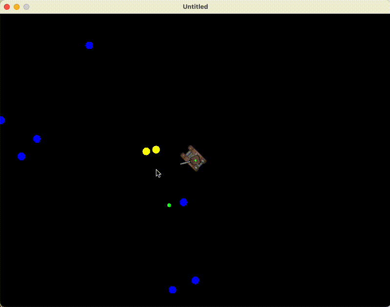

# firstGameEverLove2d

## Background

This is the first game I've ever created, with or without any frameworks.

This game is presented here no more than itself, either for those that are starting to learn, or for anyone, including me myself in future, to gain insights in any possible way.

GL HF.

## The Game

You control a tank, firing bullets at endlessly spawned hostile bubbles.
- Control: wasd, or arrows
- Enemy: bubble with 3 stages, blue -> yellow -> red
- Death penalty: none. Only prints 'Ouch' to console right now.
  - [ ] TODO: add camera shaking effect when player is hit.

## Development

see DEVELOPMENT for dev log, references and some dev tips I had along the way.

## License

refer to LICENSE
